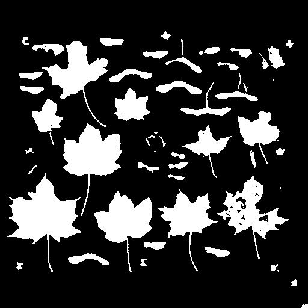
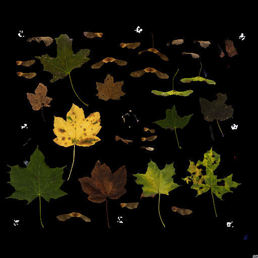
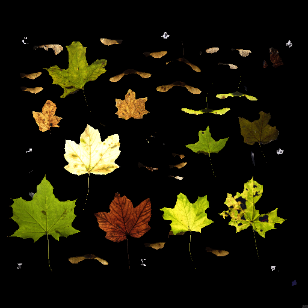
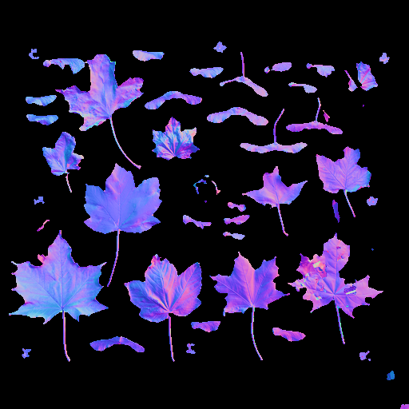
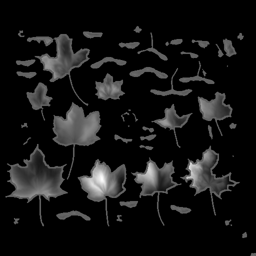
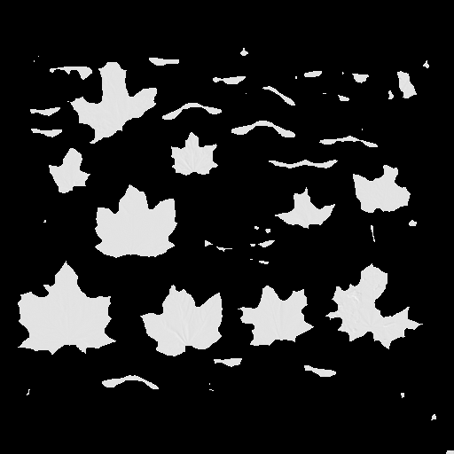
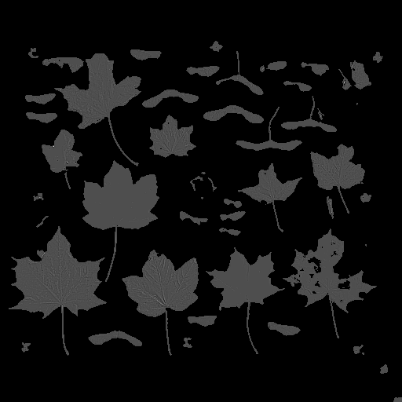

# Photometric Stereo Mappings (WIP)

|Mapping Type|Example Image|
|---|---|
|**Opacity Mapping** from Normal Mapping. ||
|**Albedo Mapping**  from Differently Lit Images witch Exposure Fusion. [1] ||
|**Translucency Mapping** from Differently Lit Images with Exposure Fusion. [^1] ||
|**Normal Mapping** from Differently Lit Images with Photometric Stereo. [^2] [^3] ||
|**Height Mapping** from Normal Mapping with Averaged Integrals from Rotated Discrete Origin Functions. ||
|**Ambient Occlusion Mapping** from Height Mapping with Normalized Blurred Difference ||
|**Roughness Mapping** from Normal Mapping with Inverse of Normalized Blurred . ||

---
[^1]: Mertens, Tom, Jan Kautz, and Frank Van Reeth. "Exposure fusion." 15th Pacific Conference on Computer Graphics and Applications (PG'07). IEEE, 2007.

[^2]: Woodham, Robert J. "Photometric method for determining surface orientation from multiple images." Optical engineering 19.1 (1980): 139-144.

[^3]: Wu, Lun, et al. "Robust photometric stereo via low-rank matrix completion and recovery." Asian Conference on Computer Vision. Springer, Berlin, Heidelberg, 2010.